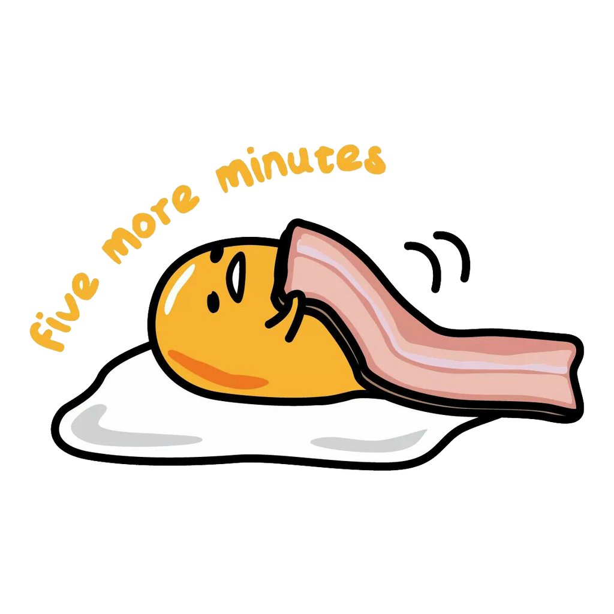

class: left, middle

```{r xaringan-themer, include=FALSE, warning=FALSE}
#https://pkg.garrickadenbuie.com/xaringanthemer/articles/themes.html
options(htmltools.dir.version = FALSE)
knitr::opts_chunk$set(echo = F, warning = F, message = F)
library(xaringanthemer)
library(showtext)

style_solarized_light()
# style_mono_accent(
#   base_color = "#1c5253",
#   header_font_google = google_font("Josefin Sans"),
#   text_font_google   = google_font("Montserrat", "300", "300i"),
#   code_font_google   = google_font("Fira Mono")
# )
```

## What you will learn

- time series (slides are your best reference!)
- scatterplots
- correlation, covariance

## Resources

- Textbook ch 1.6 (scatterplots), ch 2.1.4 (correlation, linear relationships)

- Warning: Textbook does not have a dedicated section on time series, though they do appear. These notes are your main resource.

---
class: inverse, center, middle

# Time series

---
class: left, top

## A **time series is a numeric variable**

## with a special relationship to another variable, 

## TIME

## measured in some units, 

## e.g. seconds, months, whatever

---
class: left, top

# Show up *everywhere*

### [gross domestic product](https://fred.stlouisfed.org/series/GDP/), [arctic sea ice extent](https://www.climate.gov/news-features/understanding-climate/climate-change-minimum-arctic-sea-ice-extent), your college grades, [K-pop group sizes](https://pudding.cool/2020/10/kpop/), crude birth rate, average daily temperature, [employment rate](https://fred.stlouisfed.org/series/LREM25TTUSM156S), [covid cases/deaths](https://github.com/nytimes/covid-19-data), [police shootings](https://github.com/washingtonpost/data-police-shootings), [concentration of a contaminant in river water](https://www.waterqualitydata.us/), [song popularity](https://archive.ics.uci.edu/ml/datasets/FMA%3A+A+Dataset+For+Music+Analysis), movie studio revenues, [presidential approval ratings](https://fivethirtyeight.com/features/since-the-capitol-attack-trumps-approval-rating-has-plummeted-at-a-record-rate/) and [so so much baseball data](https://github.com/chadwickbureau/baseballdatabank/tree/master/core)
---
class: left, top

## Today's example: Female life expectancy at birth, [World Bank data](https://data.worldbank.org/indicator/SP.DYN.LE00.IN)

annual, from 1960-2018, also on the course github page.

```{r}
knitr::kable(head(read.csv('https://raw.githubusercontent.com/brendanrbrown/stor155_sp21/main/data/wb_lifexpec.csv')))
```

---
class: left, top

## Things to know about time series

.pull-left[

### values **appear in order**

### so you can't re-arrange the rows!

### **meaningless without time** variable

### **histograms are not as useful here**
]
.pull-right[
### **trend** is a persistent relationship of variable with time

### **increasing:** variable *tends to* increase as time increases

### **decreasing:** variable *tends to* decrease as time increases
]

---
class: left, top
#### **This is a time series plot.** We'll discuss in the group exercise.

#### plots created in [notebook on github site](github.com/brendanrbrown/notebooks/wb_health.ipynb)


---
class: left, top


---
class: left, top


---
class: left, top

## Other ways to view and evaluate time series variables

### **Changes per period**, from one time unit to the next, e.g.

$$\text{life expectancy 1961} - \text{life expectancy 1960}$$

### **Average change:**, i.e. the mean of the changes per perid

$$\text{average change} > 0 \quad \text{can say } \quad \text{'increasing on average', 'increasing trend'}$$

$$\text{average change} < 0 \quad \text{can say } \quad \text{'decr. on average', 'decr. trend'}$$

---
class: left, top


---
class: left, top

## How to read a time series plots

.pull-left[
### Trends:

- original time series: look at the **slope** (rise/run)
- positive slope means increasing trend
- ask how well it sticks to a straight line
- **trends over short periods?**

### Min, max are easy, quantiles are hard to see
]
.pull-left[
### **Guess the mean** by imagining a *horizontal* line through the middle of the data

### **Mean of changes per period** same as slope of original! 
$$\frac{\text{final value} - \text{first value}}{\text{number periods}}$$
]

---
class: left, top


---
class: inverse, center, middle

# Scatterplots and correlation

---
class: left, top

## How to evaluate the relationship between any two numeric variables?

### Scatterplot

- one variable on the x axis, one on the y axis
- points are pairs of $(x, y)$ values
- describes **how y changes when x changes** and vice versa

### Correlation and covariance

- **two-sample statistics** describing **linear relationships**
- meaning, how well does a line through your scatterplot capture its shape?
- more on that later

---
class: center, top


---
class: center, top


---
class: left, top

## What am I seeing?

### **x-axis:** US life expectancy variable values

### **y-axis** Chinese life expectancy variable values for the **same row**, meaning same year

.pull-left[
```{r}
d <- read.csv('https://raw.githubusercontent.com/brendanrbrown/stor155_sp21/main/data/wb_lifexpec.csv')

knitr::kable(head(d[, c("United.States", "China")], 3))
```
]


---
class: left, top

## How to interpret scatter plots

.pull-left[
### Do

- "Variable y is (**increasing / decreasing / constant**) in variable x"
- Or, "variable y and x have a (**positive / negative**) relationship"
- "Variables y and x have a (**linear / non-linear**) relationship"
]

.pull-right[
### Don't

- "Variable x **causes** variable y to (increase / decrease)"

]

---
class: left, top

## Strength and type of the relationship

### **Linear relationships:** 
#### those for which you can put a straight line through the data and
approximately capture its shape.

### **How straight is straight enough to be 'linear'?**

#### Conclusions based on scatterplots often are open to interpretation!

#### Make this a quantitative evaluation with **correlation** statistic.

---
class: center, top


---
class: left, top

### Things you could say

- US and Chinese female life expectancy have a **positive** relationship

- Chinese female life expectancy is **increasing** in US female life expectancy

- US, Chinese female life expectancy have an **somewhat linear** relationship


---
class: left, top


---
class: left, top


---
class: left, top

## Definitions of some two-sample statistics:

$$X_1, X_2 \ldots X_n , \quad \quad Y_1, Y_2 \ldots Y_n$$

e.g. $X_1, Y_1 =$ US and Chinese life expectancies in 1960, respectively. 

Remember the notation: $\bar{X}$ is the mean and $Var(X)$ is the variance, a measure of how 'spread out' a variable is from its mean.

.pull-left[
#### **Standard deviation** (one-sample)
The square root of the variance, $$\sqrt{Var(X)} = sd(X)$$


]

.pull-right[

#### **Sample covariance**

$$Cov(X, Y) = \frac{\sum_{i = 1}^n (X_i - \bar{X})(Y_i - \bar{Y})}{n}$$


]

.center[
#### **Sample correlation**

$$r = \frac{Cov(X, Y)}{sd(X)sd(Y)}$$
]

---
class: left, top


---
class: center, middle

link to scatterplot in final poll question [wb_lifexpec_scatter_all](https://github.com/brendanrbrown/stor155_sp21/blob/main/notebooks/images/wb_lifexpec_scatter_all.jpeg)

---
class: center, middle



???
image credit: deviantart.com/atsushika28