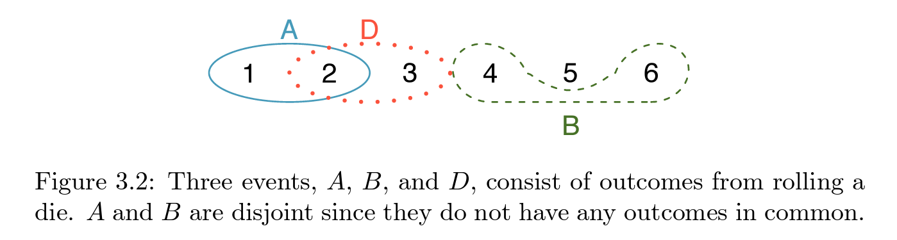
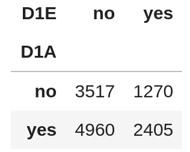

class: left, middle


```{r xaringan-themer, include=FALSE, warning=FALSE}
#https://pkg.garrickadenbuie.com/xaringanthemer/articles/themes.html
options(htmltools.dir.version = FALSE)
knitr::opts_chunk$set(echo = F, warning = F, message = F)
library(xaringanthemer)
library(showtext)

style_solarized_light()
# style_mono_accent(
#   base_color = "#1c5253",
#   header_font_google = google_font("Josefin Sans"),
#   text_font_google   = google_font("Montserrat", "300", "300i"),
#   code_font_google   = google_font("Fira Mono")
# )
```


## What you will learn

- definition of conditional probability and Bayes' Theorem
- computing conditional probabilities

## Resources

- Textbook: ch 3.2

---
class: left, top

## March 11-12 are covid spring break

## No data homework, no class, no OH

## **Webassign homework will be due one week from today**

## You've been warned: Don't do it at the last minute

#### leave time to go to tutorials and to ask me questions


---
class: inverse, center, middle

# Conditioning on known information

---
class: left, top

## Old example: Briscola card deck with 40 cards, 4 suits (cups, coins, swords, clubs)

$$X = 1 \text{ if cups on first draw, 0 otherwise} = 1_{\{\text{cups on first}\}}$$
$$Y = 1 \text{ if cups on second draw, 0 otherwise} = 1_{\{\text{cups on second}\}}$$

### Sampling with replacement

$$P(Y = 1) = \text{ ? if I told you that } X = 1$$

### Sampling without replacement
Pull a card, set it aside and draw again.

$$P(Y = 1) = \text{ ? if I told you that } X = 1$$

---
class: center, middle

### Another example

#### Roll a die but don't look. 

#### I look and tell you the roll is in set A. 

#### What is the probability your roll is 2?


*image credit: textbook ch 3*

---
class: left, top

## **Partial information** about a random process's outcome **changes the probabilities.**

## Conditional probability lets us incorporate partial information in the correct way.

## Important to have formulas because usually it's not so obvious how to do this!


---
class: inverse, center, middle

# Conditional probability

---
class: left, top

## Joint distributions
$X, Y$ are two discrete random variables with outcomes $x_1 \ldots x_n$ and $y_1 \ldots y_m$.

.pull-left[
### Definition: joint distribution
The collection of probabilities

$$P(X = x_i \text{ and } Y = y_j)$$

$$= P(\{X = x_i\} \cap \{Y = y_j\})$$

for every outcome $x_i$ of $X$ and $y_j$ of $Y$
]
.pull-right[
### Example
Roll a 6-sided die $X = 1_{\{\text{even number}\}}$, $Y = 1_{\{\text{1 or 2 or 3}\}}$

$$P(X = 1 \text{ and } Y = 1)$$
$$= \frac{\text{# even and } <= 3}{6} = \frac{1}{6} $$
$$P(X = 0 \text{ and } Y = 1)$$

$$= \frac{\text{# odd and } <= 3}{6} = \frac{1}{3}$$
]

---
class: left, top

## Marginal distributions from joint

The **'marginal distribution'** of $X$ is what we have already seen: The collection of probabilities $P(X = x_1), P(X = x_2) \ldots$.

.pull-left[
### Sum over all possible $X$ to get marginal of $Y$

$$P(Y = y_j) = \sum_{i = 1}^n P(X = x_i \text{ and } Y = y_j)$$

#### in words

The probability $Y$ has outcome $y_j$ is the probability $Y = y_j$ *and $X$ takes one of its possible values.*

But $X$ always has to take *some* value!
]
.pull-right[
### Example
same setup as the previous slide

$$P(Y = 1)$$
$$= P(X = 1 \text{ and } Y = 1)$$

$$+ P(X = 0 \text{ and } Y = 1)$$
$$= 1/6 + 1/3$$
$$= 1/2$$
]

---
class: left, top

## Bayes' rule for sets

.pull-left[
### conditional probability of $A$ **given** $B$
is written

$$P(A|B)$$
#### in words

I know something in set $B$ has happened. Given that I have this information, what is the chance something in set $A$ happened?
]
.pull-right[
### the rule
this is always true so long as $P(B) > 0$, meaning $B$ can happen with some chance.

$$P(A|B)$$
$$= \frac{P(A\cap B)}{P(B)}$$
]

---
class: left, top

### SHED survey example

From old homework: A survey of household economic stability. `D1A` is whether worked for pay last month, `D1E` is whether wanted to work more.



#### Suppose we use this to calculate our probabilities

$A =$\{D1A is yes\}, $B$ = \{D1E is yes\}, total num. observations is 12,152

$$P(B) = \text{ ? } \quad \quad P(A | B) = \text{ ?} $$

---
class: inverse, center, middle

# Revisiting independence

---
class: left, top

## General multiplication rules for probability

### This holds for any sets $A$, $B$

$$P(A \cap B) = P(A|B) P(B) = P(B|A) P(A)$$

### Just a restatement of Bayes' rule
Multiply both sides of Bayes' rule by the denominator

---
class: left, top

### Conceptual definition of independence
>> "Two sets are independent if knowing the outcome of one provides no useful information about the outcome of the other."

### now has a mathematical interpretation

$$A, B \text{ independent means } \quad P(A|B) = P(A)$$

#### *literally* if you know $B$ happened you do not update your probability that $A$ happened.

### Q: Translate this to the example of sampling with/without replacement?

---
class: inverse, center, middle

# Conditional probability rules and distributions

---
class: left, top

## Rules of probabilities apply to conditional probabilities too

$A, B, D$ are sets and $P(B) > 0$ so that conditioning on $B$ makes sense.

$$P(A \cup D | B) = P(A | B) + P(D | B) - P(A \cap D | B)$$

If $A, D$ are **disjoint** sets

$$P(A \cap D | B) = P(\varnothing | B) = 0$$

$$P(S | B)  = P(B | B) = 1$$

chance that $B$ happens given that you know $B$ happened is 1.

---
class: left, top
### To understand this you need a little more set algebra
Think of $\cup$ as $+$ and $\cap$ as $\times$ from regular algebra.

$$(A \cup D) \cap B = (A\cap B) \cup (D \cap B)$$

$$(A \cap D) \cap B = A \cap D \cap B$$

$$A, D \text{ disjoint means } (A\cap B), (D \cap B) \text{ disjoint}$$

### Conditional probability rules from Bayes theorem

If $A, D$ are **disjoint**, then $(A\cap B), (D \cap B)$ are too and
$$P(A \cup D | B) = \frac{P\left( (A \cup D) \cap B\right)}{P(B)} = \frac{P\left(A \cap B\right) + P\left(D \cap B\right)}{P(B)}$$
$$= P(A|B) + P(D|B)$$

---
class: top, left

## Conditional distributions for random variables exist as well
Conditional distribution of $X$ **given $Y = y_j$**

$$P(X = x_i \,| \, Y = y_j) = \frac{P(X = x_i \text{ and } Y = y_j)}{P(Y = y_j)}$$
Since this is a distribution of $X$ given $Y = y_j$, the $x_i$ vary but $y_j$ doesn't. Conditioning on different outcomes of $Y$ gives different distributions.
### Old example
Roll a 6-sided die $X = 1_{\{\text{even number}\}}$, $Y = 1_{\{\text{1 or 2 or 3}\}}$

$$P(Y = 1 \,|\, X = 1) = \frac{P(X = 1 \text{ and } Y = 1)}{P(X = 1)}= \frac{1/6}{1/2} = 1/3$$
---
class: inverse, center, middle

# False positives, false negatives

---
class: top, left

### Setup: You get tested for presence of SARS-CoV-2
$X = 1_{\{\text{have disease}\}}$ and $Y = 1_{\{\text{test positive}\}}$

#### Testing is complicated and depends a lot on whether you have symptoms or other risk factors

#### Here: Asymptomatic testing

### Terminology
Medicine has a way of giving complicated names to simple ideas. You'll find [this website](https://online.stat.psu.edu/stat507/lesson/10/10.3) helpful.
$$\text{Sensitivity} = P(Y = 1 \, | \, X = 1)$$
$$\text{Specificity} = P(Y = 0 \, | \, X = 0)$$

---
class: left,top

### These are really what you care about

$$\text{Positive predictive value (PPV)} = P(X = 1 \, | \, Y = 1)$$
$$\text{Negative predictive value (NPV)} = P(X = 0 \, | \, Y = 0)$$

### actual study data
from table 1 of [this study](https://www.cdc.gov/mmwr/volumes/69/wr/pdfs/mm695152a3-H.pdf) at two Wisconsin universities, for 'No current symptoms'

```{r}
d <- data.frame('Y = 1' = c(7, 14), 'Y = 0' = c(10, 840), row.names = c('X = 1', 'X = 0'))
knitr::kable(d, col.names = c('Y = 1', 'Y = 0'), row.names = TRUE)
```


### Qs
- Probability I have covid if I test positive?
- Probability I don't have covid if I test negative?

---
class: center, top
background-image: url(gudetama2.png)
background-size: contain
### our hero needs a wellness day: no poll

???
image credit: deviantart.com/atsushika28