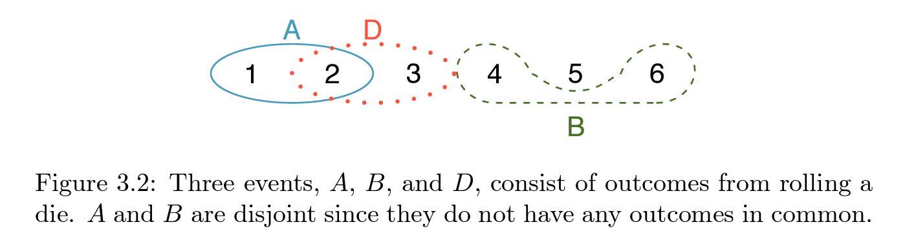
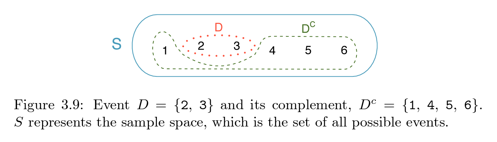
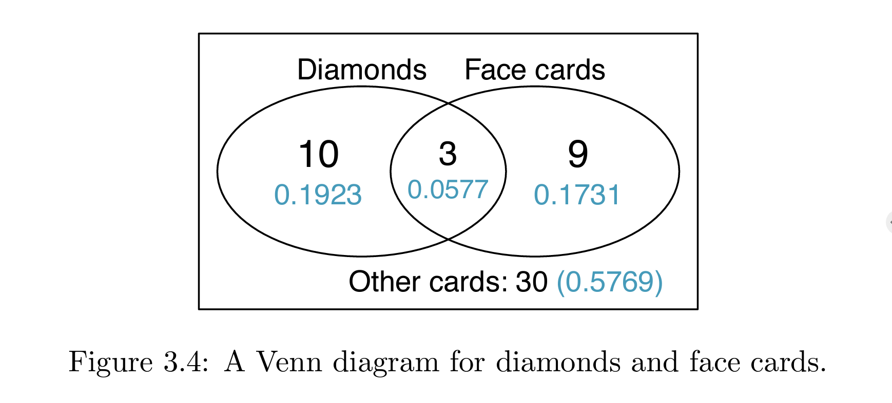

class: left, middle


```{r xaringan-themer, include=FALSE, warning=FALSE}
#https://pkg.garrickadenbuie.com/xaringanthemer/articles/themes.html
options(htmltools.dir.version = FALSE)
knitr::opts_chunk$set(echo = F, warning = F, message = F)
library(xaringanthemer)
library(showtext)

style_solarized_light()
# style_mono_accent(
#   base_color = "#1c5253",
#   header_font_google = google_font("Josefin Sans"),
#   text_font_google   = google_font("Montserrat", "300", "300i"),
#   code_font_google   = google_font("Fira Mono")
# )
```


## What you will learn

- sets and set algebra
- probability rules of sets
- discrete distributions
- variance and expecation of discrete distributions

## Resources

- Textbook: ch 3.1.2-4, 3.4 (random variables), ch 4.3.1 (Bernoulli)

---
class: inverse, center, middle

# Sets

---
class: left, top

### Remember: General method for calculating probabilities when all choices are equally likely

$$P(X = x_i) = \frac{\text{number of ways outcome } x_i \text{ can happen}}{\text{number of choices}}$$

### example: pick one random card from a [briscola deck](https://en.wikipedia.org/wiki/Briscola)

there are **40 cards** and **four suits** with an equal number of cards: clubs, coins, cups and swords.

$$X = 1 \quad \text{if card is cups},  \quad \quad X = 0 \quad \text{if not}$$

### This is such an important and useful concept that we need to make it more precise

---
class: left, top

## Definition: Set

>> a set is a **collection of outcomes** for a random process

.pull-left[
### Notation

#### will use curly braces, e.g. 

$\{1, 2, 3\}$ 

#### for a set of outcomes 1, 2, 3.

#### capital letters as a shorthand, e.g. 

$A = \{1, 2, 3\}$

]
.pull-right[
### Example

#### draw a cups from a briscola deck

$$A = \{1\text{ of cups}, 2\text{ of cups, } ... \text{ King of cups}\} $$

#### roll an even number on six-sided die

$$A = \{2, 4, 6\} $$

]

---
class: left, top

### Set algebra

.pull-left[
#### unions

$$A \cup B = A \text{ or } B$$
#### example

$$A = \{ 2, 4, 6 \} , \quad B = \{ 1 \}$$

$$A \cup B = \{1, 2, 4, 6\}$$

]
.pull-right[

#### intersections

$$A \cap B = A \text{ and } B$$

#### example

$$A = \{2, 4, 6\}, \quad B = \{2\}$$

$$A \cap B = \{2\}$$


]

### the **empty set** and the set of **all outcomes**

$$S = \text{ all possible outcomes, a.k.a 'sample space'}$$

$$\varnothing = \text{ the empty set, the set with no outcomes}$$ 


$$\{2, 4, 6 \} \cap \{1\} = \varnothing$$
because these two sets have no outcomes in common
---
class: center, middle

### Disjoint sets

$A$ and $B$ are **disjoint if they have no outcomes in common**

$$A, B \text{ are disjoint if } \quad A\cap B = \varnothing$$



*image credit: textbook ch 3*
---
class: center, middle

### Set complement

the complement of a set $A$ is denoted $A^c$ 

and is the **collection of outcomes not in $A$**



#### **you tell me**

$$A \cup A^c = ?$$

$$A \cap A^c = ?$$

---
class: inverse, center, middle

# Probabilities of sets of outcomes

---
class: left, top

## Recap

$$P(X = x) \quad \text{is} \quad \text{the probability r.v. X takes outcome } x$$

#### $X = x$ is an outcome and therefore can be written as a set

$$A = \{X = x\}$$

#### this is more useful when we want to collect several outcomes into a set

$$B = \{X = x_1 \text{ or } x_2 \text{ or } x_3\} = \{X = x_1\} \cup\{X = x_2\} \cup\{X = x_3\}$$

## Probabilities of sets

$$P(A) = \text{ probability that some outcome in A happens}$$


---
class: left, top

## Golden rule

>> something will happen for sure

$$P(S) = \text{ probability that something happens} = 1$$

$$P(\varnothing) = \text{ probability that nothing happens} = 0$$

## Don't double count

>> for **any two sets** the following formula is true

$$P(A \cup B) = P(A) + P(B) - P(A\cap B)$$


---
class: left, top

## Addition rule

#### 'don't double count' rule simplified if sets disjoint

>> if A, B are **disjoint** sets, then the probability A or B occurs is the probability of A plus the probability of B

in mathematical terms this means

$$P(A \cup B) = P(A) + P(B) \quad \quad \text{if A, B disjoint}$$

and for multiple sets

$$P(A_1 \cup A_2 \cup \ldots A_n) = \sum_{i = 1}^n P(A_i) \quad \quad \text{if } A_i\cap A_j = \varnothing \quad i\neq j$$

### you tell me

$$P(A) + P(A^c) = \text{ ? }$$

$$P(A \cap A^c)  = \text{ ?}$$

---
class: left, top

### Revisited: General formula when all outcomes equally likely

Say there are $N$ possible outcomes, $S = \{1, 2 \ldots N\}$.

$$P(\{i\}) = 1/N, \quad \quad \text{if all equally likely }$$

Each outcome is disjoint, so this make sense

$$P(S) = \sum_{i=1}^N P(\{i\}) = 1$$

Now take $A$ to be some collection of outcomes

$$P(A) = \sum_{i \, in \, A} P(\{i\}) = \frac{\text{number outcomes in A}}{N} = \frac{\text{number outcomes in A}}{\text{number of outcomes total}}$$

For example,   if $A = \{1, 2, 3, 4\}$ and $N = 10$

$$P(A) = P(\{1\}) +P(\{2\}) + P(\{3\}) + P(\{4\}) = 4/10 = 2/5$$

---
class: center, middle

### Venn diagrams can help

You draw one card from a U.S.-standard 52-card deck
$$A = \{ \text{cards with diamonds} \}, \quad B = \{ \text{cards with faces} \}$$

$$P(A) = \frac{\text{number outcomes in A}}{52}$$




---
class: inverse, center, middle

# Independence

---
class: left, top

## Conceptually

>> "Two sets are independent if knowing the outcome of one provides no useful information about the outcome of the other."


## Independence for sets

#### sets A, B are independent if

$$P(A \cap B) = P(A) P(B)$$

## Independence of random variables

#### random variables $X$, $Y$ are independent if each collection of their outcomes is independent as sets

---
class: left, top

## Example


.pull-left[
### Setup

- draw two cards from a briscola deck
- 40 cards, 4 suits (cups, swords, clubs, coins)

$$X = 1 \text{ if cups on first draw}$$

$$Y = 1  \text{ if cups on second draw}$$

]
.pull-right[

### Is it reasonable to think of $X, Y$ as independent?
Use the conceptual definition above

### If so,

$$P(\{X = 1\} \cap \{Y = 1 \}) = \text{ ? }$$
]

---
class: inverse, center, middle

# Discrete probability distributions

---
class: left, top

### For a discrete random variable $X$
Individual outcomes are **disjoint** by definition.

$$\text{possible outcomes of X are } \quad S = \{x_1, x_2 \ldots x_N \}$$

### Definition:

The **distribution of $X$** is the collection of probabilities

$$P(X = x_1), P(X = x_2),  \ldots,  P(X = x_N)$$

#### **Remember** they must add to one

$$\sum_{i=1}^N P(X = x_i) = 1$$

---
class: left, top


### Example: Indicator random variable

$$1_A \text{ denotes the indicator variable for the set }A $$

$$1_A = 1 \text{ if an outcome in A happened }, \quad  1_A = 0 \text{ if not}$$

If my random variable $X = 1_A$ for some set $A$, how can I represent the distribution of $X$?

### Example: Discrete uniform distribution

$X$ is a random variable with $N$ possible outcomes $S = \{x_1, x_2 \ldots x_N \}$.

$X$ has the discrete uniform distribution **if all outcomes are equally likely**

$$P(X = x_i) = \text{ ? }$$


---
class: left, top

### Recap: Expectation a.k.a. the mean
A weighted average of possible outcomes

$$E(X) = \sum_{i=1}^N x_iP(X = x_i)$$

### Variance
Theoretical, weighted-average version of sample variance, **tells how spread out a random variable is relative to the mean.**

$$Var(X) = \sum_{i=1}^N P(X = x_i) (x_i - E(X))^2$$

### Standard deviation

$$SD(X) = \sqrt{Var(X)} $$


---
class: left, top
## Example: Bernoulli distribution

.pull-left[
### Definition

$X$ is a Bernoulli distributed random variable if for some set $A$

$$X = 1_A$$

- a discrete distribution

- with outcomes $S = \{0, 1 \}$

- and distribution

$$P(X = 1) = P(A)$$
$$P(X = 0) = 1 - P(A)$$


]
.pull-right[
### Examples
Many of the examples we've seen already are Bernoulli
$$A = \{\text{cups in Briscola deck}\}$$

$$X = 1_A$$
$$P(X = 1) = P(A) = 1/4$$
#### Can apply to any situation in which $X = 1$ marks a 'success' and $X = 0$ a failure.
]


---
class: left, top

## Poll EV setup
Use this in the poll questions today

Sneetches are creatures that are either yellow or blue, not both, and have up to two stars painted on their bellies. 

In this Sneetch village there are 56 residents, and I made the following observations:

```{r}
s <- data.frame(set = c('yellow bellies', 'one star', 'blue bellies and no stars'),
                number = c(21, 9, 12))

knitr::kable(s)
```

#### Assume belly color and number of stars are independent
by which I mean if $A = \{\text{yellow bellies}\}$ then $A$ is independent from any set involving number of stars.


---
class: center, middle

## PollEv.com/brendanbrown849

## poll closes at `_________`

### You'll need to do a little algeba using the definitions!


---
class: center, middle


???
image credit: deviantart.com/atsushika28